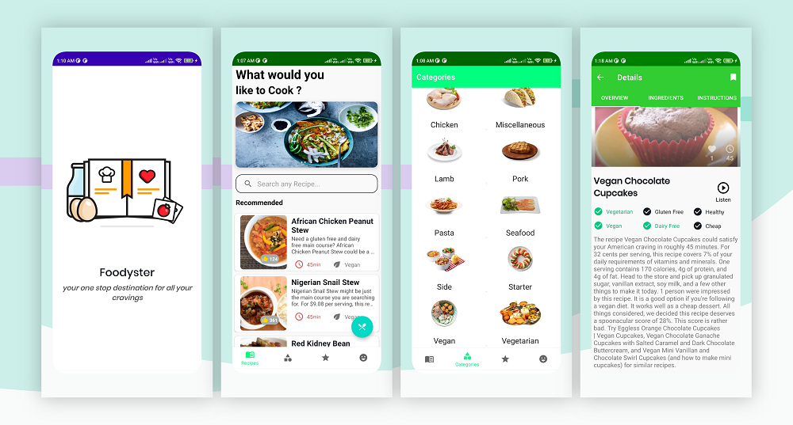

# Foody

Foody is a minimalistic food recipes app 📱 built to demonstrate the use of Modern Android
development tools with MVVM Architecture including Dependency Injection(Hilt),Flow , Retrofit ,
Room , Offline Caching and many more.

## Features 🚀

- Search any Recipe of your choice
- Pick among different Categories
- Listen to any Recipe on the Go
- Get detailed description all the recipes
- Bookmark your favourite recipes.
- Get the recipes details within the application.
- Access the recipe using offline caching without internt connection
- Random Food Jokes to share it with your friends

# Screenshots

## Light Mode

  

## Requirements 🎯
- Android 5.0 and Above
- Min sdk version 21

## Permissions 💻
- Internet
